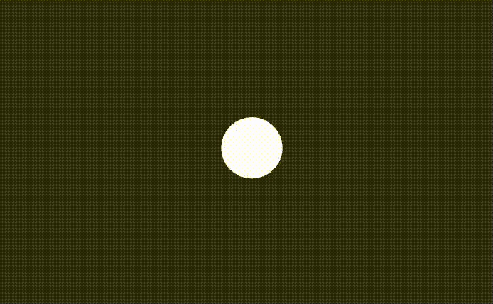

# Figure 8 Bevy Demo

The square is the child of the camera (this allows the square to move when the camera moves). The circle is standing still and the camera moves and the square moves with the camera. 

Notes:

Due to using the ScalingMode::FixedVertical { viewport_height: 100. } for the camera. The height of the camera in world units is always 100. and the width is decided by the aspect ratio of the window. 
The center of the camera is (0., 0.) the bottom-left is (-X,-50) the top-right (X., 50.) where X is decided by the aspect ratio of the window.
